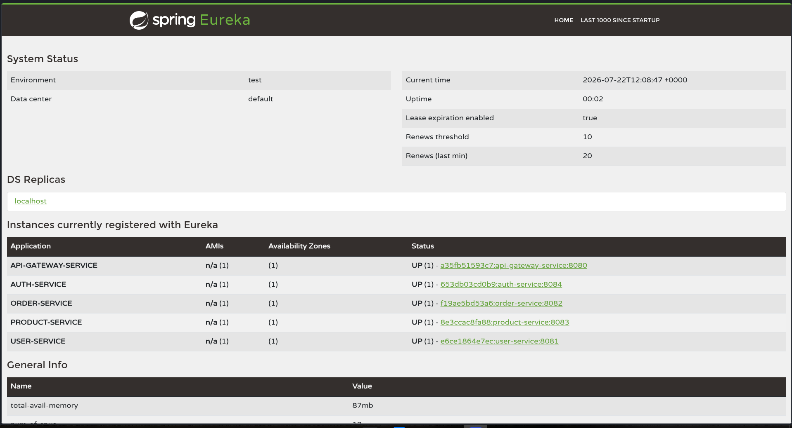
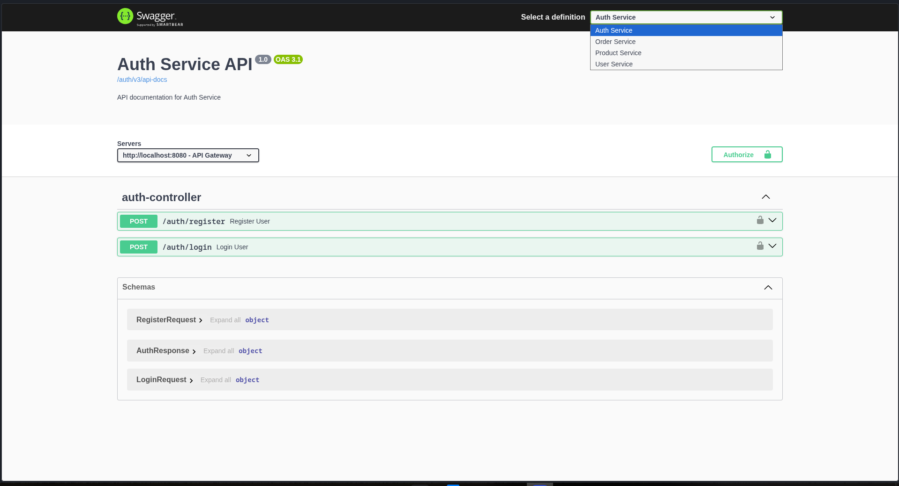
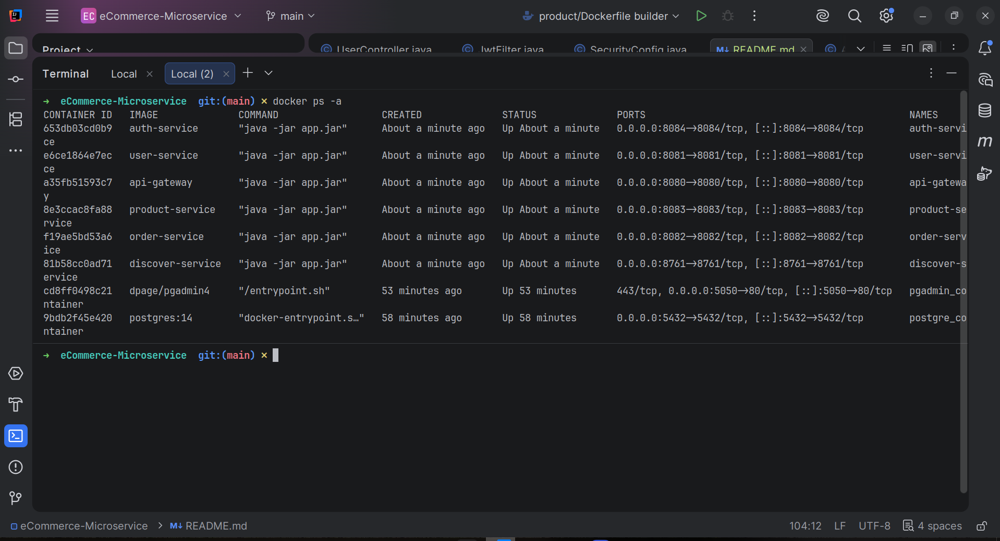

# E-Commerce Microservices

This project is a backend e-commerce application built using Spring Boot and Spring Cloud. I started it to learn how a microservices architecture works in practice and to understand how different services communicate with each other.

Instead of building everything as a single application, each module is developed as an independent service with its own responsibility. The services are connected through API Gateway and Eureka Discovery, while authentication is handled using JWT.

---

## Screenshots

### Eureka Dashboard



### Swagger UI



### Docker Containers



## Services

- **Auth Service** – Handles user registration, login, and JWT generation.
- **User Service** – Stores and manages user profile information.
- **Product Service** – Manages products and their details.
- **Order Service** – Handles order placement and order history.
- **API Gateway** – Single entry point for all requests.
- **Discovery Service** – Service registration and discovery using Eureka.

---

## Tech Stack

- Java 21
- Spring Boot
- Spring Security
- Spring Cloud Gateway
- Spring Cloud Netflix Eureka
- OpenFeign
- Spring Data JPA
- PostgreSQL
- Docker & Docker Compose
- Swagger / OpenAPI
- Maven

---

## Features

- JWT-based authentication
- User registration and login
- Automatic user profile creation after registration
- Product management APIs
- Order placement
- Order history
- Admin order status updates
- Service discovery with Eureka
- API Gateway routing
- Inter-service communication using OpenFeign
- Request validation using Bean Validation
- Global exception handling
- Swagger documentation
- Dockerized microservices

---

## Project Structure

```
ecommerce-microservices
│
├── api-gateway
├── auth-service
├── discover-service
├── order-service
├── product-service
├── user-service
├── docker-compose.yml
└── README.md
```

---

## Running the Project

Clone the repository

```bash
git clone https://github.com/<your-username>/ecommerce-microservices.git
```

Go to the project directory

```bash
cd ecommerce-microservices
```

Start all services

```bash
docker compose up --build
```

---

## API Documentation

Swagger UI is available after the application starts.

```
http://localhost:8080/swagger-ui/index.html
```

---

## Learning

Building this project helped me understand:

- Designing applications using a microservices architecture
- Service discovery with Eureka
- Routing requests through an API Gateway
- Implementing JWT authentication using Spring Security
- Communication between services using OpenFeign
- Bean Validation and centralized exception handling
- Containerizing Spring Boot applications with Docker
- Organizing backend applications into independent services

---

## Future Improvements

There are still a few things I'd like to add:

- Shopping Cart Service
- Inventory Service
- Payment Integration
- Notification Service
- React frontend

---

## Author

**Lalit Mohan Mishra**

If you have any suggestions or feedback, feel free to open an issue or connect with me.